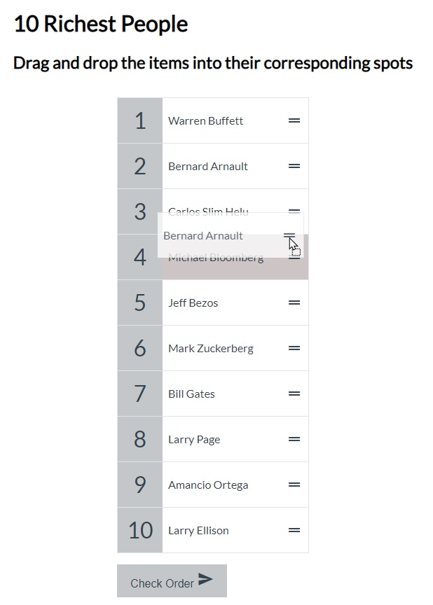

# Ramdon Meal Generato

A web page to practice the fetch API of HTM5

- 🎯 Main Goal: [HTML5 API - FETCH] Practice with Fetch Api.
- 🕹️ Live Demo: [link](https://orses.github.io/vanilla_javascript/fetch_random_meal/src/)

## Credits

- Project from: 100 Days - 100 Projects Challenge by Florin Pop, project Day 001

  > Projects website [link](https://www.florin-pop.com/blog/2019/09/100-days-100-projects/)

- REST API from **TheMealDB API** (themealdb.com)
  > Test API version website [link](https://www.themealdb.com/api.php)
