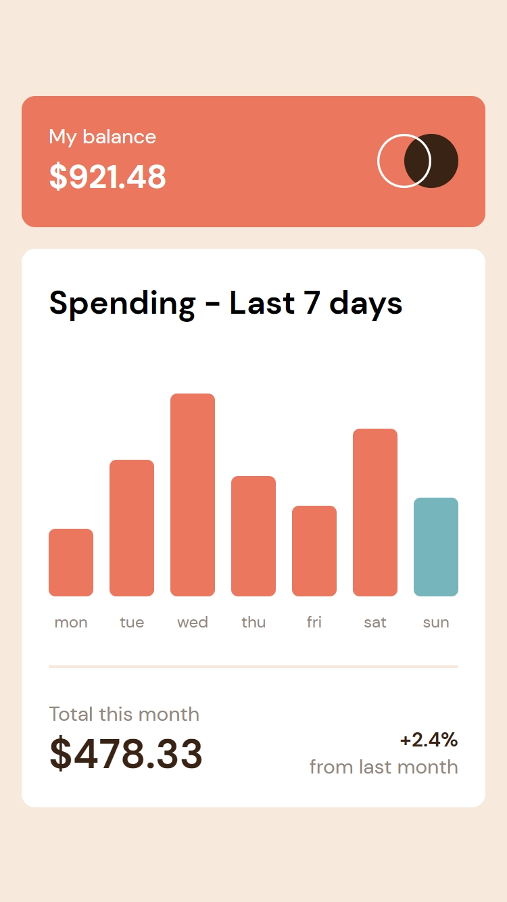
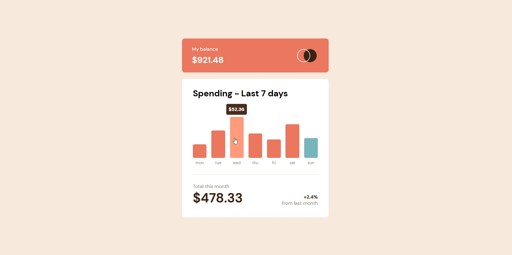

# Frontend Mentor - Expenses chart component solution

This is a solution to the [Expenses chart component challenge on Frontend Mentor](https://www.frontendmentor.io/challenges/expenses-chart-component-e7yJBUdjwt). Frontend Mentor challenges help you improve your coding skills by building realistic projects.

## Table of contents

- [Overview](#overview)
  - [The challenge](#the-challenge)
  - [Screenshot](#screenshot)
  - [Links](#links)
- [My process](#my-process)
  - [Built with](#built-with)
  - [What I learned](#what-i-learned)
  - [Continued development](#continued-development)
- [Author](#author)
- [Acknowledgments](#acknowledgments)

**Note: Delete this note and update the table of contents based on what sections you keep.**

## Overview

### The challenge

Users should be able to:

- View the bar chart and hover over the individual bars to see the correct amounts for each day
- See the current day’s bar highlighted in a different colour to the other bars
- View the optimal layout for the content depending on their device’s screen size
- See hover states for all interactive elements on the page
- **Bonus**: Use the JSON data file provided to dynamically size the bars on the chart

### Screenshot

### Links

- Solution URL: [Fronted Mentor](https://www.frontendmentor.io/challenges/expenses-chart-component-e7yJBUdjwt/hub/chart-card-with-data-from-a-json-file-E97JjWj_Sh)
- Live Site URL: [GitHub](https://orses.github.io/vanilla_javascript/card_chart/src/)

## My process

### Built with

- Mobile-first workflow
- Semantic HTML5 markup
- BEM names for CSS class
- CSS custom properties
- Flexbox
- CSS Grid
- CSS variables
- JS with Fetch API
- JSON file for chart data source

### What I learned

It's been interesting working with CSS Grid again and optimizing Heydon Pickering and Andy Bell's "Every Layout" layout system.

### Continued development

Continue developing CSS Grid to consolidate and test with different layouts.

## Author

- Frontend Mentor - [@orses](https://www.frontendmentor.io/profile/orses)

## Acknowledgments

Thanks to Frontend Mentor and all the people behind designing and creating challenges.
And thanks to everyone who participates giving their opinion on the projects of others. It is good to hear other opinions and perspectives.
