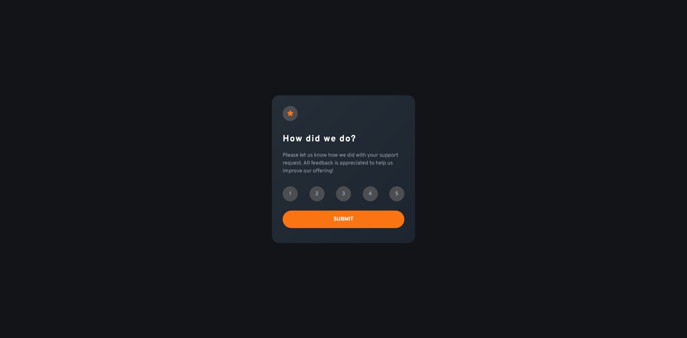
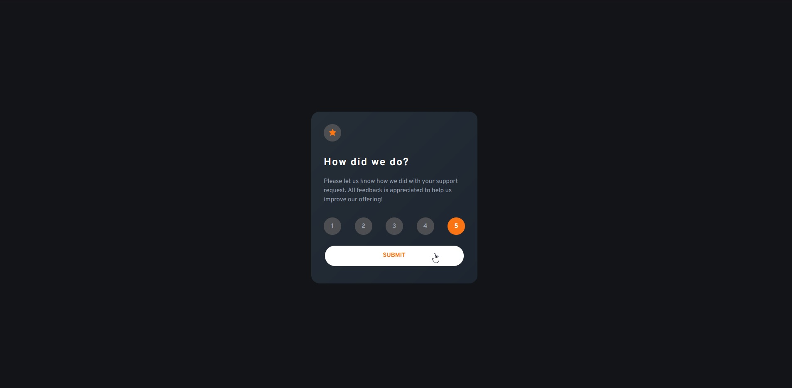
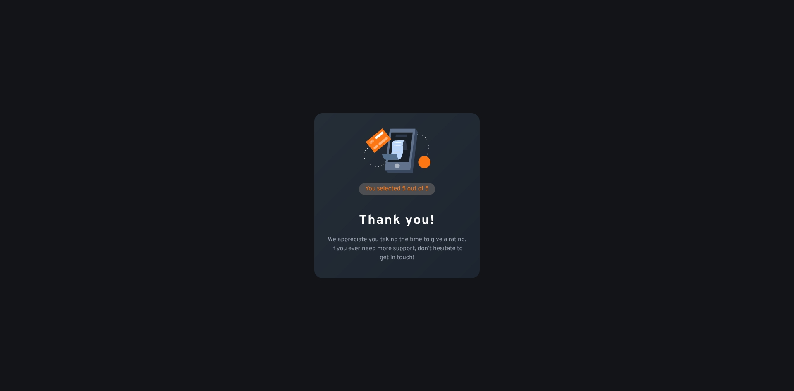
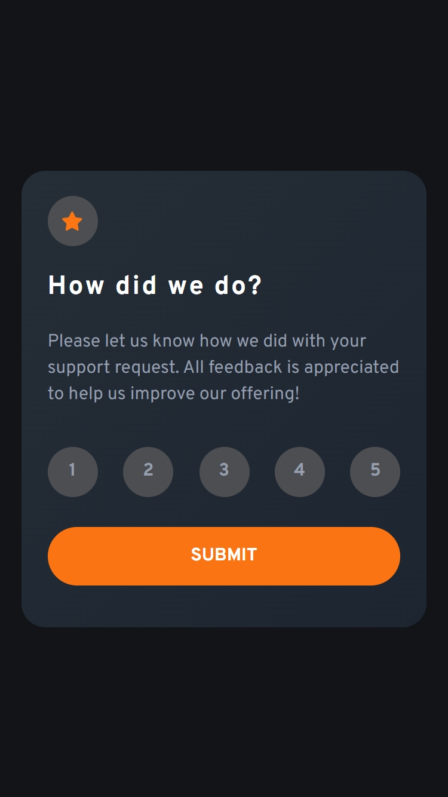
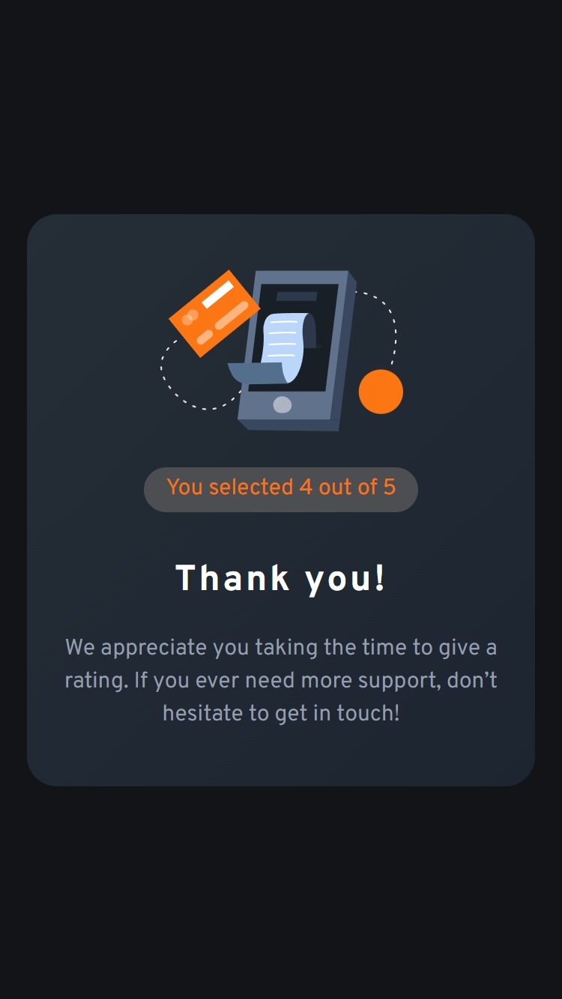

# Frontend Mentor - Interactive rating component solution

This is a solution to the [Interactive rating component challenge on Frontend Mentor](https://www.frontendmentor.io/challenges/interactive-rating-component-koxpeBUmI). Frontend Mentor challenges help you improve your coding skills by building realistic projects.

## Table of contents

- [Overview](#overview)
  - [The challenge](#the-challenge)
  - [Screenshot](#screenshot)
  - [Links](#links)
- [My process](#my-process)
  - [Built with](#built-with)
  - [What I learned](#what-i-learned)
  - [Continued development](#continued-development)
  - [Useful resources](#useful-resources)
- [Author](#author)
- [Acknowledgments](#acknowledgments)

## Overview

A web page to ask the user for a rating and respond with a thank you and the selected rate.

- 🎯 Main Goal: Working with radio buttons with accessibility and DOM manipulation

### The challenge

Users should be able to:

- View the optimal layout for the app depending on their device's screen size
- See hover states for all interactive elements on the page
- Select and submit a number rating
- See the "Thank you" card state after submitting a rating

### Screenshot

### Links

- Solution: [Frontend Mentor](https://www.frontendmentor.io/solutions/interactive-rating-with-accessible-radio-buttons-JSLXqomNeP)
- Live Site: [Github](https://orses.github.io/vanilla_javascript/card_rating_interactive/src/)

## My process

### Built with

- Mobile-first workflow
- Semantic HTML5 markup
- BEM names for CSS class
- CSS custom properties
- Flexbox
- Every Layout design
- CSS variables
- CSS media queries
- Radio button accessibility

### What I learned

This project has allowed me to use and style fully accessible radio buttons.

### Continued development

The way to implement and design the rest of the controls that are part of a web form, but looking for them to be fully accessible.

### Useful resources

- [Inclusive Hiding & Styling Checkboxes and Radio Buttons by Sara Soueidan](https://www.sarasoueidan.com/blog/inclusively-hiding-and-styling-checkboxes-and-radio-buttons/)
- [Replacing Radio Buttons Without Replacing Radio Buttons by Heydon Pickerin](https://www.sitepoint.com/replacing-radio-buttons-without-replacing-radio-buttons/)
- [WTF, forms? by Mark Otto](http://wtfforms.com/)

## Author

- Frontend Mentor - [@orses](https://www.frontendmentor.io/profile/orses)

## Acknowledgments

Thanks to Frontend Mentor and all the people behind designing and creating challenges.
And thanks to everyone who participates giving their opinion on the projects of others. It is good to hear other opinions and perspectives.
