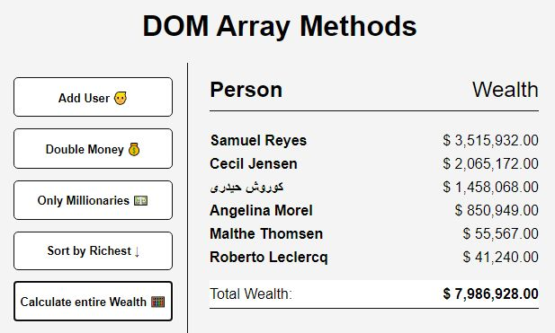

# DOM Array Methods

A web page to practice some very useful methods for arrays with a list of data from an external REST API

- Main Goal: Practice with array methods (reduce, sort, filter, map and forEach) with a data list o people from a REST API.
- Live Demo: [link](https://orses.github.io/vanilla_javascript/dom_array_methods/src/)

## Credits

- Project from: Udemy course "20 Web Projects With Vanilla JavaScript"

  > Course website [link](https://www.udemy.com/course/web-projects-with-vanilla-javascript)

- REST API from **Random User Generator** (randomuser.me)

> Random User Generator website [link](https://randomuser.me/)
