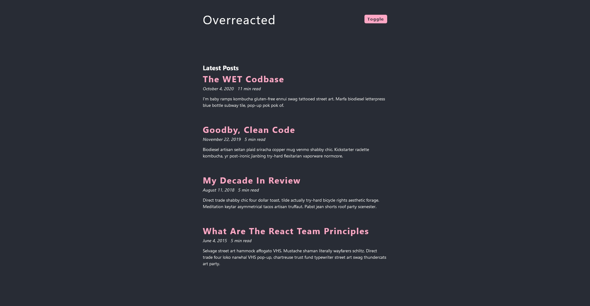

<<<<<<< HEAD
# Dark theme

A basic page to practice dark and light mode theme using a CSS class and JS

- 🎯 Main Goal: Working CSS and JS to change the page theme
- 🕹️ Live Demo: [link](https://orses.github.io/vanilla_javascript/dom_dark_mode/src/)
- 🔵 Level: Newbie

## Credits

- Project from: Udemy course "JavaScript tutorial and Projects Course 2022" by John Smilga

  > Course website [link](https://www.udemy.com/course/javascript-tutorial-for-beginners-w/)

  The current project is based on the one that appears in the credits, but it is not exactly the same, since it incorporates small adaptations and personal experimentations like naming class using BEM on CSS; and reorganization of files and functions on JS.

## Screenshots

### Mobile design

### Desktop design

=======
# Dark theme

A basic page to practice dark and light mode theme using a CSS class and JS

- 🎯 Main Goal: Working CSS and JS to change the page theme
- 🕹️ Live Demo: [link](https://orses.github.io/vanilla_javascript/dom_dark_mode/src/)
- 🔵 Level: Newbie

## Credits

- Project from: Udemy course "JavaScript tutorial and Projects Course 2022" by John Smilga

  > Course website [link](https://www.udemy.com/course/javascript-tutorial-for-beginners-w/)

  The current project is based on the one that appears in the credits, but it is not exactly the same, since it incorporates small adaptations and personal experimentations like naming class using BEM on CSS; and reorganization of files and functions on JS.

## Screenshots

### Mobile design

### Desktop design

>>>>>>> 8214b560d7a6b0eca37d02a19be1f25d87d015b1
