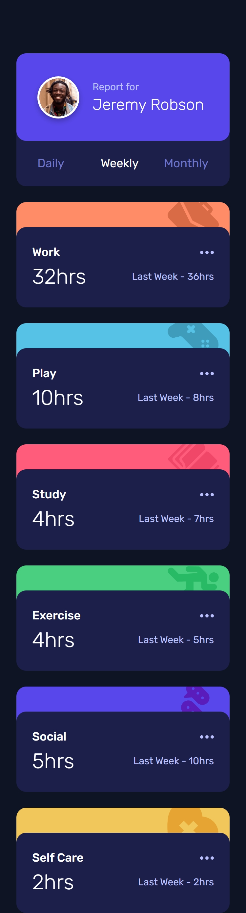
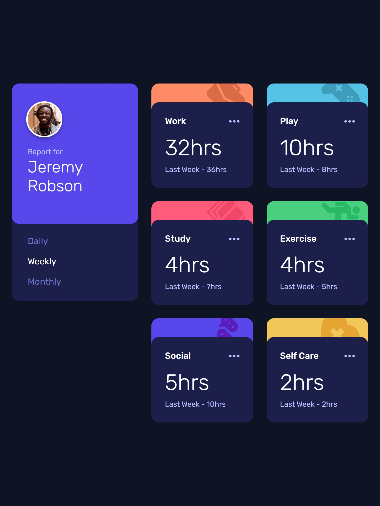
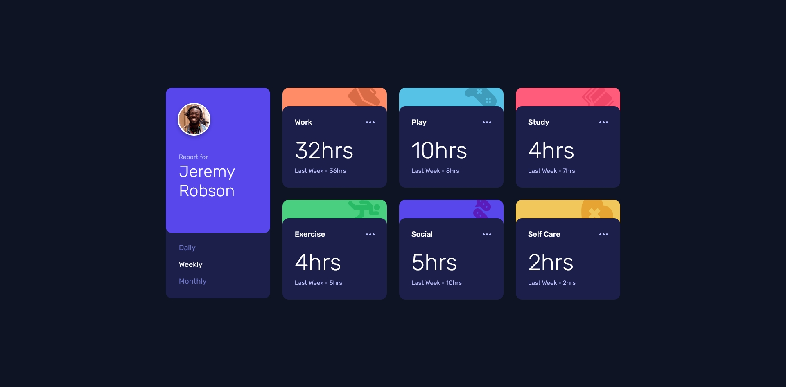
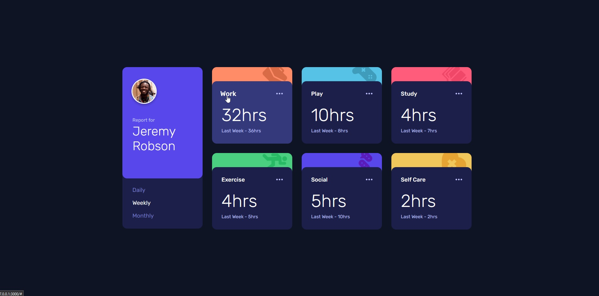

# Frontend Mentor - Time tracking dashboard solution

This is a solution to the [Time tracking dashboard challenge on Frontend Mentor](https://www.frontendmentor.io/challenges/time-tracking-dashboard-UIQ7167Jw). Frontend Mentor challenges help you improve your coding skills by building realistic projects.

## Table of contents

- [Overview](#overview)
  - [The challenge](#the-challenge)
  - [Screenshot](#screenshot)
  - [Links](#links)
- [My process](#my-process)
  - [Built with](#built-with)
  - [Continued development](#continued-development)
- [Author](#author)
- [Acknowledgments](#acknowledgments)

**Note: Delete this note and update the table of contents based on what sections you keep.**

## Overview

### The challenge

Users should be able to:

- View the optimal layout for the site depending on their device's screen size
- See hover states for all interactive elements on the page
- Switch between viewing Daily, Weekly, and Monthly stats

### Screenshot

### Links

- Solution URL: [Fronted Mentor](https://www.frontendmentor.io/solutions/dashboard-with-data-from-a-local-json-file-using-fetch-api-L7X1P7Jujh)
- Live Site URL: [GitHub](https://orses.github.io/vanilla_javascript/dom_dashboard/src/)

## My process

### Built with

- Mobile-first workflow
- Semantic HTML5 markup
- BEM names for CSS class
- CSS custom properties
- Flexbox
- CSS Grid
- CSS variables
- JS with Fetch API
- JSON file for data user

### Continued development

Continue studying what has to do with accessibility and semantics. On the other hand, implementations of SVG.

## Author

- Frontend Mentor - [@orses](https://www.frontendmentor.io/profile/orses)

## Acknowledgments

Thanks to Frontend Mentor and all the people behind designing and creating challenges.
And thanks to everyone who participates giving their opinion on the projects of others. It is good to hear other opinions and perspectives.
