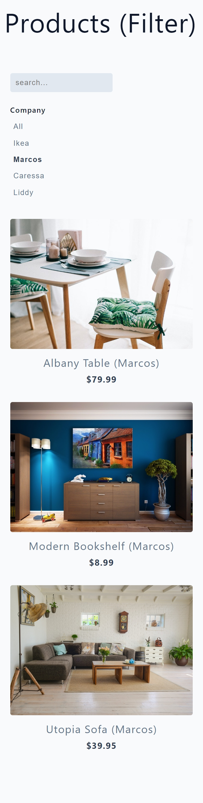

# Filters for products by search text and select button

A basic page to practice filters to update the DOM using a input search and a group of buttons

- 🎯 Main Goal: Working with JS to change by the user the data show on the page
- 🕹️ Live Demo: [link](https://orses.github.io/vanilla_javascript/dom_filters/src/)
- 🔵 Level: Newbie

## Credits

- Project from: Udemy course "JavaScript tutorial and Projects Course 2022" by John Smilga

  > Course website [link](https://www.udemy.com/course/javascript-tutorial-for-beginners-w/)

  The current project is based on the one that appears in the credits, but it is not exactly the same, since it incorporates small adaptations and personal experimentations like naming class using BEM on CSS; and reorganization of files and functions on JS.

## Screenshots

### Mobile design

### Desktop design

