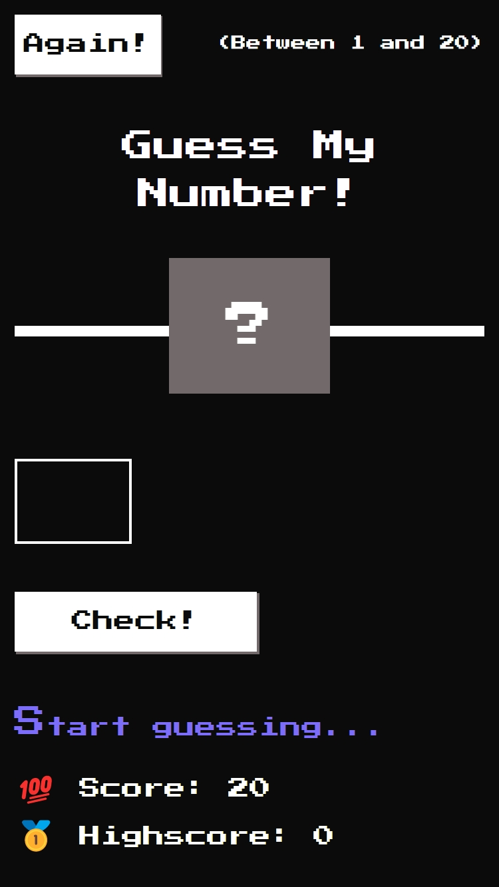
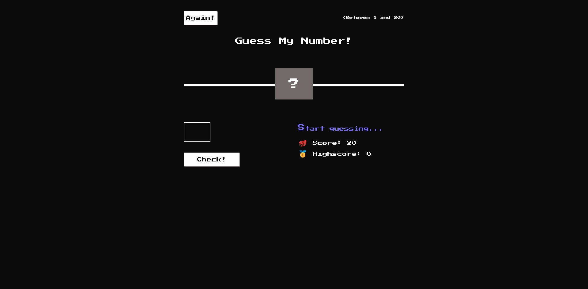
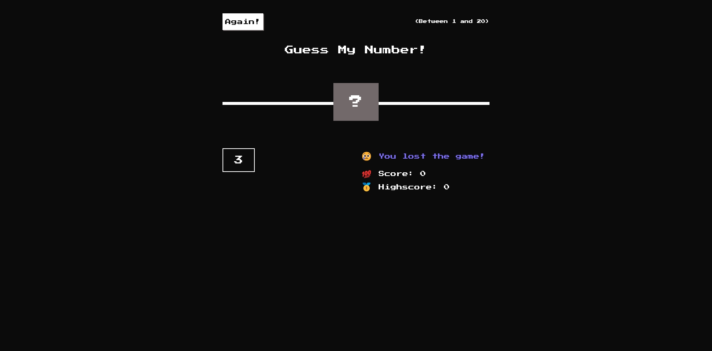
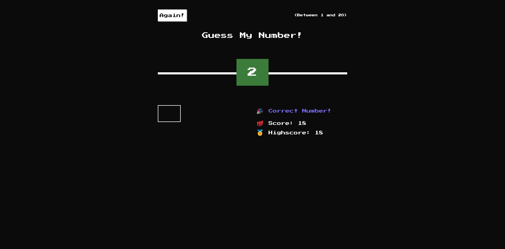

# Guess My Number!

A web page to practice DOM manipulation.

- Main Goal: [DOM] Practice with DOM manipulation.
- Live Demo: [link](https://orses.github.io/vanilla_javascript/dom_guess_number/src/)

## Credits

- Project from the Udemy course: _The Complete JavaScript Course 2022: From Zero to Expert!_ by Jonas Schmedtmann

  > Udemy course [link](https://www.udemy.com/course/the-complete-javascript-course/)

The current project is based on the one that appears in the credits, but it is not exactly the same, since it incorporates small adaptations and personal experimentation's like: first mobile and responsive design for CSS and HTML; and IIFE, objects and functionality programming for JS; also a form to use the Enter key as associated with check button.
