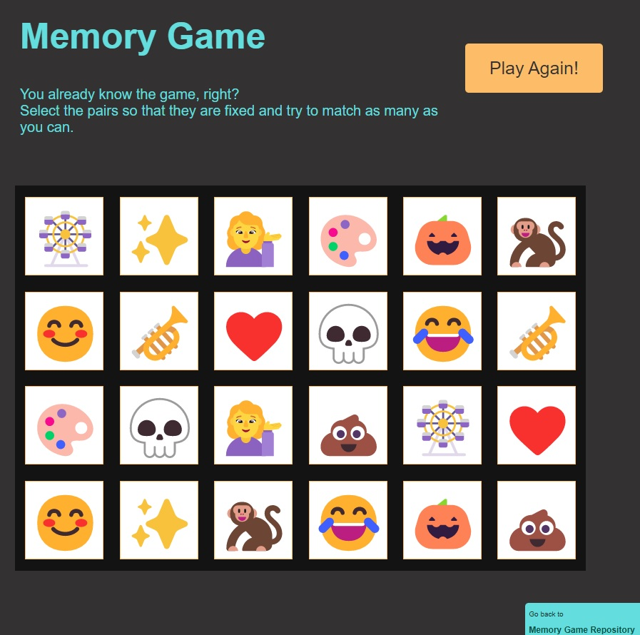

# DOM - Memory Game

A web page to practice the DOM manipulation with arrays and CSS classes.

- Main Goal: [DOM] Practice with DOM, arrays and CSS classes.
- Live Demo: [link](https://orses.github.io/vanilla_javascript/dom_memory_game/src/)

## Credits

- Project from: Memory Game Programming Tutorial - by Adam Khoury

  > Projects website [link](http://www.developphp.com/video/JavaScript/Memory-Game-Programming-Tutorial)
  > Project video on Youtube [link](https://youtu.be/c_ohDPWmsM0)

- CSS animation for conffeti effect inspired from Purple Heart Rain by Florin Pop (Youtube video: 10 JavaScript Projects in 1 Hour - Coding Challenge) [link](https://youtu.be/8GPPJpiLqHk?t=1348)

- Image Azulejos de mármol marrón (CC0) from Pixabay [link](https://www.pexels.com/es-es/foto/azulejos-de-marmol-marron-220152/)

The current project is based on the one that appears in the credits, but it is not exactly the same, since it incorporates small adaptations and personal experimentations like event delegations, emojis and ES6 module functionality.
