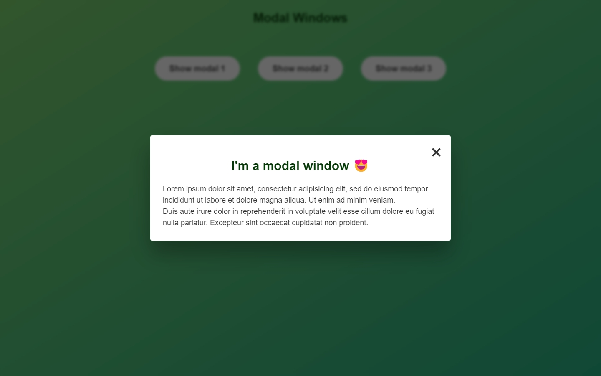
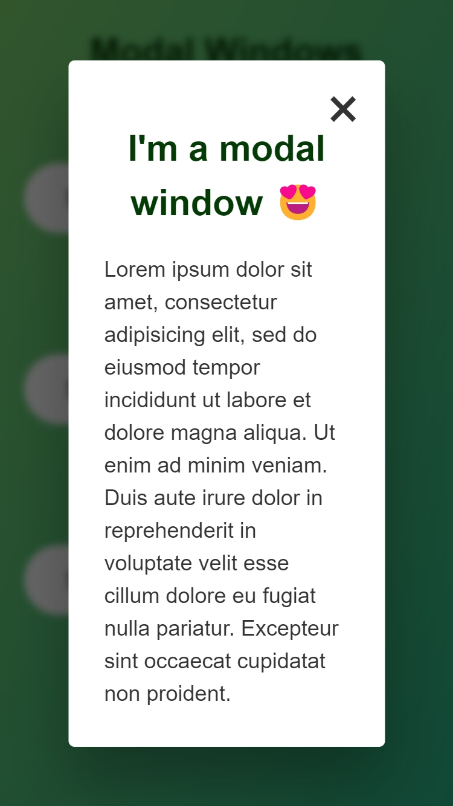
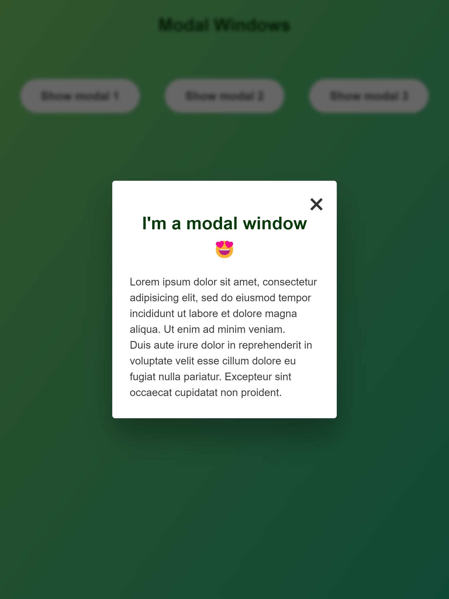

# DOM: Modals

A web page to practice DOM manipulation.

- 🎯 Main Goal: [DOM] Practice with DOM manipulation and with modal in specific.
- 🕹️ Live Demo: [link](https://orses.github.io/vanilla_javascript/dom_modals/src/)
- 🔵 Level: Newbie

## Credits

- Project from the Udemy course: _The Complete JavaScript Course 2022: From Zero to Expert!_ by Jonas Schmedtmann

  > Udemy course [link](https://www.udemy.com/course/the-complete-javascript-course/)

  The current project is based on the one that appears in the credits, but it is not exactly the same, since it incorporates small adaptations and personal experimentation's like: first mobile, BEM, Animation and responsive design for CSS and HTML; and IIFE, objects and functionality programming for JS; also the HTML tags and CSS class have been restructured.

## Screenshots

### Mobile design

### Tablet design

### Desktop design

