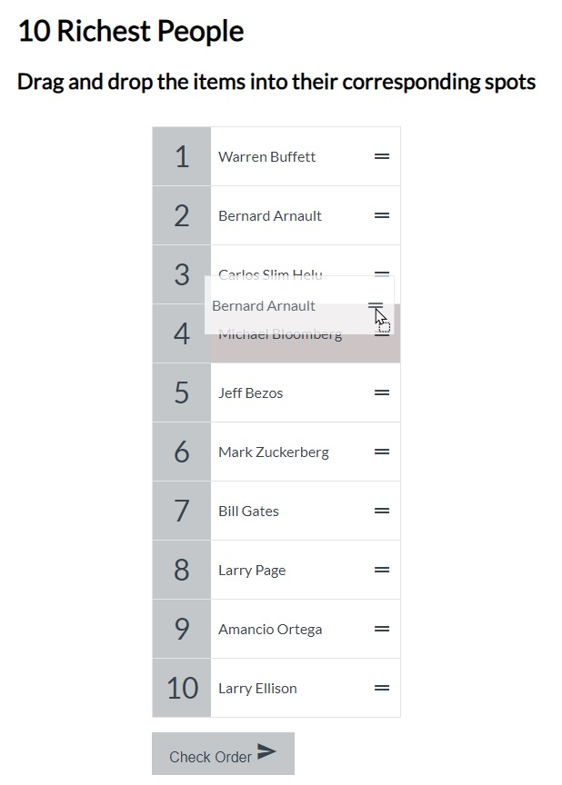

# Drap & Drop list items

A web page to practice DOM manipulation with drap & drop API of HTM5 with event delegation

- Main Goal: [HTML5 API - DRAG & DROP] Practice with DOM manipulation with Drag & Drop API.
- Live Demo: [link](https://orses.github.io/vanilla_javascript/drag_drop/src/)

## Credits

- Project from: Udemy course "20 Web Projects With Vanilla JavaScript" by Brad Traversy

  > Course website [link](https://www.udemy.com/course/web-projects-with-vanilla-javascript)

The current project is based on the one that appears in the credits, but it is not exactly the same, since it incorporates small adaptations and personal experimentations like event delegations and the dataTransfer object for the payload of Drag and Drop functionality.
