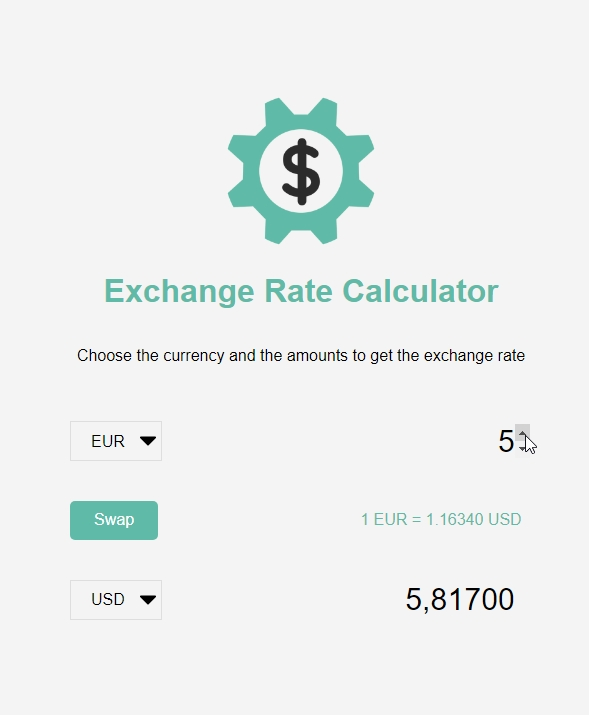

# Exchange Rate Calculator

A web page to obtain the exchange rate of different currencies using an external API to get this information.

- Main Goal: Using Fetch API, with async/await, to retrieve external information on JSON data format.
- Live Demo: [link](https://orses.github.io/vanilla_javascript/exchange_rate_calculator/src/)

## Credits

- Project from: Udemy course "20 Web Projects With Vanilla JavaScript"

  > Course website [link](https://www.udemy.com/course/web-projects-with-vanilla-javascript)

- REST API from **Foreign exchange rates API** (exchangeratesapi.io) with _European Central Bank_ as data source
  > Foreign exchange rates API website [link](https://exchangeratesapi.io/)  
  > European Central Bank [link](https://www.ecb.europa.eu/stats/policy_and_exchange_rates/euro_reference_exchange_rates/html/index.en.html)
