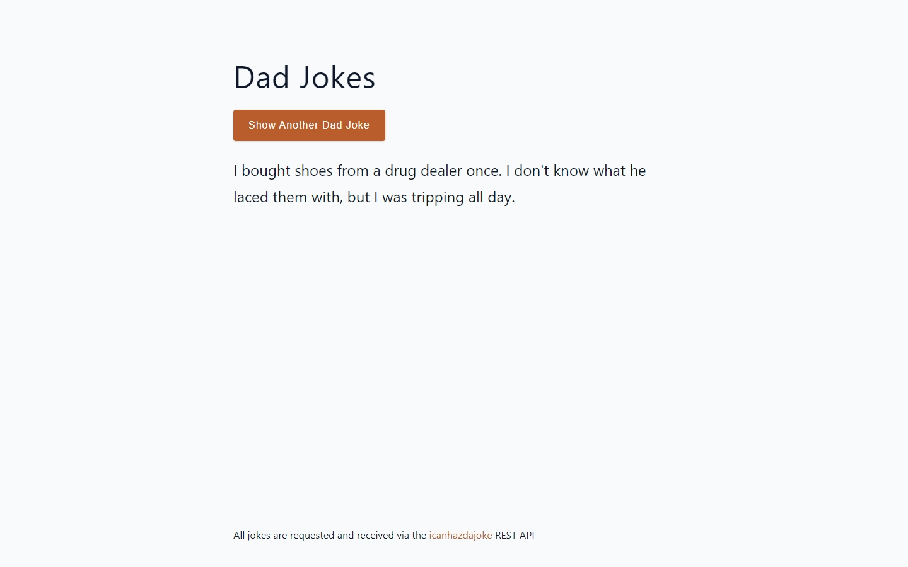
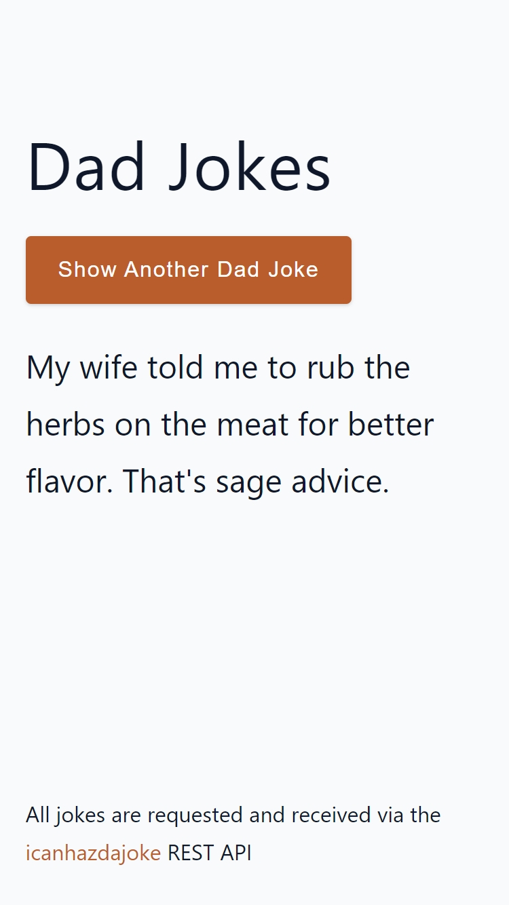

<<<<<<< HEAD
# Fetch quotes from a public API

A basic page to practice API FETCH to request single quotes (in this case, jokes)

- 🎯 Main Goal: Work with JS to change the data displayed on the page by the user, requesting new data from the server each time.
- 🕹️ Live Demo: [link](https://orses.github.io/vanilla_javascript/fetch_dad_jokes/src/)
- 🔵 Level: Newbie

## Credits

- Project from: Udemy course "JavaScript tutorial and Projects Course 2022" by John Smilga

  > [Link to course website](https://www.udemy.com/course/javascript-tutorial-for-beginners-w/)

  The current project is based on the one that appears in the credits, but it is not exactly the same, since it incorporates small adaptations and personal experimentations like

  - the attribution on HTML and CSS
  - the mobile design
  - using a different organization for files and functions on JS.

## Screenshots

### Mobile design

### Desktop design

=======
# Fetch quotes from a public API

A basic page to practice API FETCH to request single quotes (in this case, jokes)

- 🎯 Main Goal: Work with JS to change the data displayed on the page by the user, requesting new data from the server each time.
- 🕹️ Live Demo: [link](https://orses.github.io/vanilla_javascript/fetch_dad_jokes/src/)
- 🔵 Level: Newbie

## Credits

- Project from: Udemy course "JavaScript tutorial and Projects Course 2022" by John Smilga

  > [Link to course website](https://www.udemy.com/course/javascript-tutorial-for-beginners-w/)

  The current project is based on the one that appears in the credits, but it is not exactly the same, since it incorporates small adaptations and personal experimentations like

  - the attribution on HTML and CSS
  - the mobile design
  - using a different organization for files and functions on JS.

## Screenshots

### Mobile design

### Desktop design

>>>>>>> 8214b560d7a6b0eca37d02a19be1f25d87d015b1
