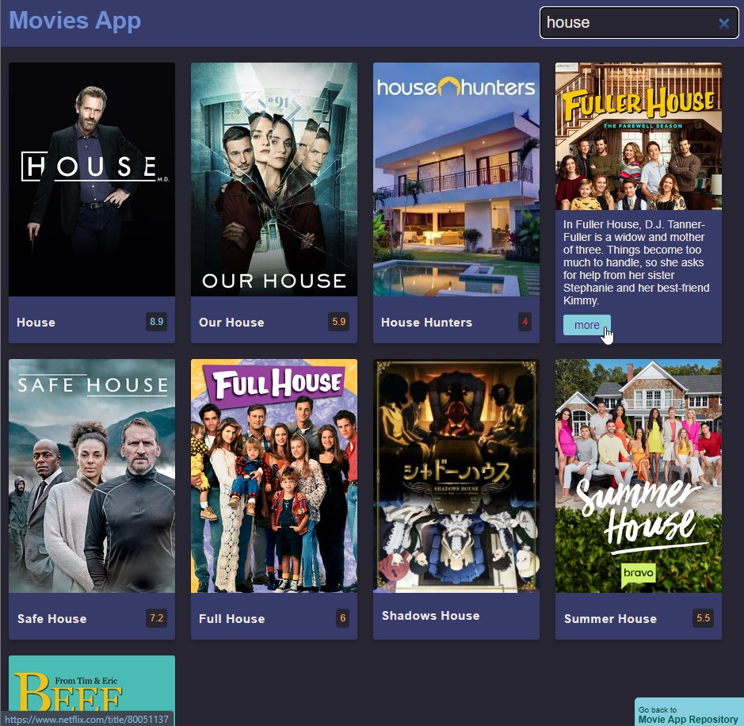

# Movie App

A web page to practice the fetch API of HTML5 and DOM manipulation

- 🎯 Main Goal: [HTML5 API - FETCH] Practice with Fetch Api and practice with CSS cards
- Features: list of movies, movie info, favourite movie, actors info.
- 🕹️ Live Demo: [link](https://orses.github.io/vanilla_javascript/fetch_movies/src/)

## Credits

- Desings from UI Design Daily by Ildiko Gaspar [link](https://uidesigndaily.com/posts/photoshop-movie-app-mobile-day-193)

- Project from: 10 JavaScript Projects by Florin Pop, project #6: Movie App

  > Youtube video [link](https://www.youtube.com/watch?v=dtkciwk_si4&list=plk5zkk61ru84dfw6ijrckxue50pxv8paf&index=12&t=17174s)

- REST API from **TVMAZE** (tvmaze.com)
  > Test API version website [link](https://www.tvmaze.com/api)

The current project is based on the one that appears in the credits, but it is not exactly the same, since it incorporates small adaptations and personal experimentations like ES6 module functionality, fetch layer, etc.
