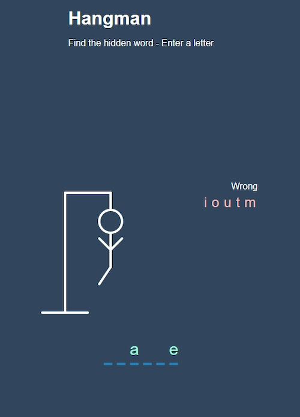
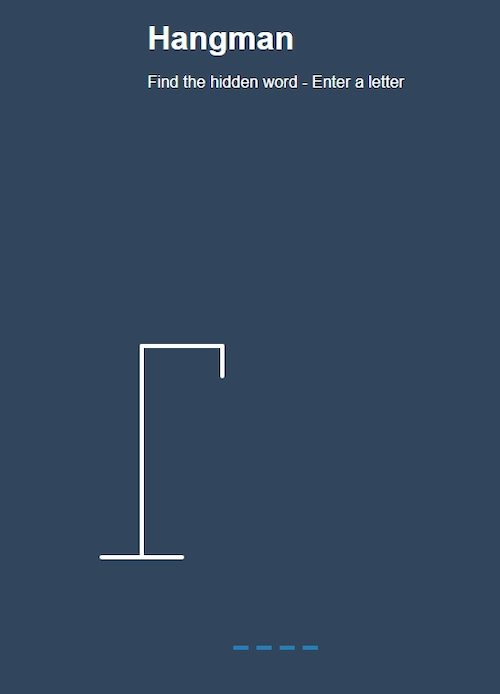
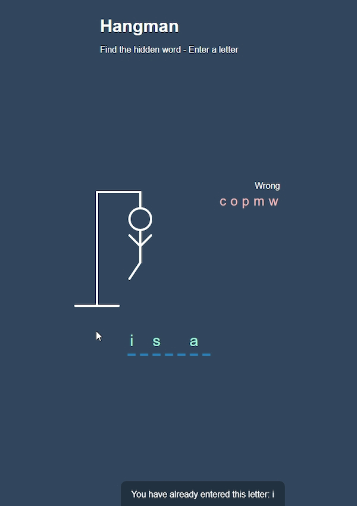
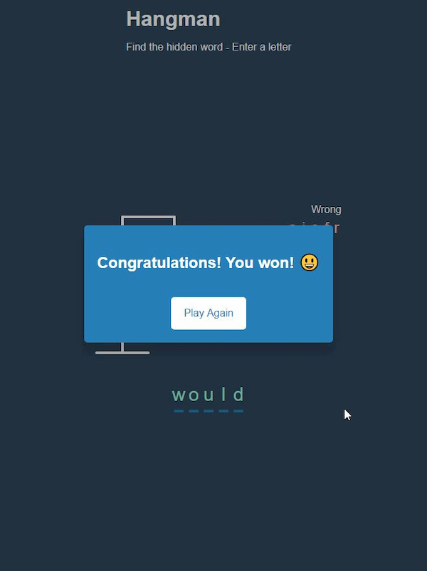

# Game: Hangman

A web page with a game, the hangman to guess a hidden word in a set amount of chances (1000+ English Words).

- Main Goal: Working with SVG, notifications and popup (modal window).
- Live Demo: [link](https://orses.github.io/vanilla_javascript/game_hangman/src/)

## Credits

- Project from: Udemy course "20 Web Projects With Vanilla JavaScript"

  > Course website [link](https://www.udemy.com/course/web-projects-with-vanilla-javascript)

- The list of words used in this project has been collected from the 7esl.com

  > 7esl.com: "1000+ Most Common Words in English from A-Z" [link](https://7esl.com/common-words/)

## Screenshots

- Start game

  

- Notification

  

- Popup

  
