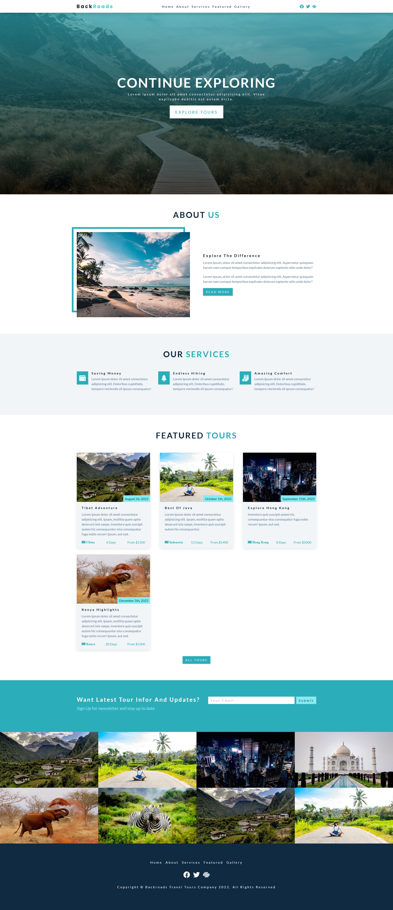

<<<<<<< HEAD
# Landing Page with Flexbox

A landing page to practice Flexbox with layouts for header, nav, cards, features, image gallery and footer

- 🎯 Main Goal: Working with Flexbox, responsive, and mobile first
- 🕹️ Live Demo: [link](https://orses.github.io/vanilla_javascript/landing_page_exploring/src/)
- 🔵 Level: Newbie

## Credits

- Project from: Udemy course "HTML & CSS Tutorial and Projects Course 2022 (Flexbox & Grid)" by John Smilga

  > Course website [link](www.udemy.com/course/in-depth-html-css-course-build-responsive-websites/

  The current project is based on the one that appears in the credits, but it is not exactly the same, since it incorporates small adaptations and personal experimentations like naming class using BEM on CSS; and IIFE on JS.

## Screenshots

### Mobile design

### Tablet design

### Desktop design

=======
# Landing Page with Flexbox

A landing page to practice Flexbox with layouts for header, nav, cards, features, image gallery and footer

- 🎯 Main Goal: Working with Flexbox, responsive, and mobile first
- 🕹️ Live Demo: [link](https://orses.github.io/vanilla_javascript/landing_page_exploring/src/)
- 🔵 Level: Newbie

## Credits

- Project from: Udemy course "HTML & CSS Tutorial and Projects Course 2022 (Flexbox & Grid)" by John Smilga

  > Course website [link](www.udemy.com/course/in-depth-html-css-course-build-responsive-websites/

  The current project is based on the one that appears in the credits, but it is not exactly the same, since it incorporates small adaptations and personal experimentations like naming class using BEM on CSS; and IIFE on JS.

## Screenshots

### Mobile design

### Tablet design

### Desktop design

>>>>>>> 8214b560d7a6b0eca37d02a19be1f25d87d015b1
