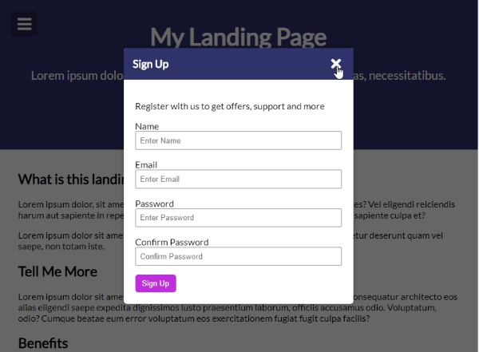
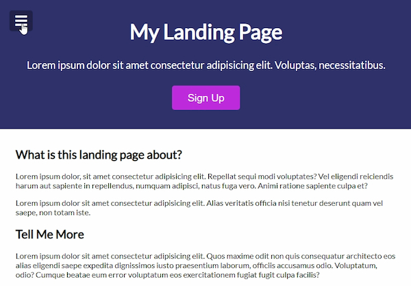
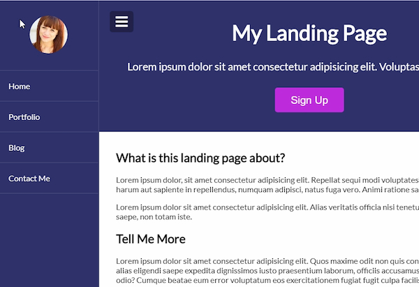
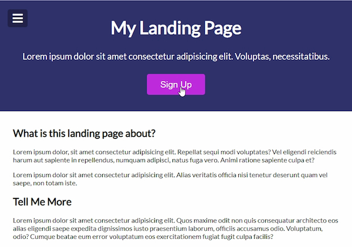

# Menu slider and modal window

A web page with a collapsible hamburger menu, and a modal window for user registration

- Main Goal: [DOM] Working with a slider, as a menu, and a modal window.
- Live Demo: [link](https://orses.github.io/vanilla_javascript/menu_slider_and_modal/src/)

## Credits

- Project from: Udemy course "20 Web Projects With Vanilla JavaScript"

  > Course website [link](https://www.udemy.com/course/web-projects-with-vanilla-javascript)

- REST API from Random User Generator (randomuser.me)

  > Random User Generator website [link](https://randomuser.me/)

## Screenshots

### Menu Slider

### Modal window

