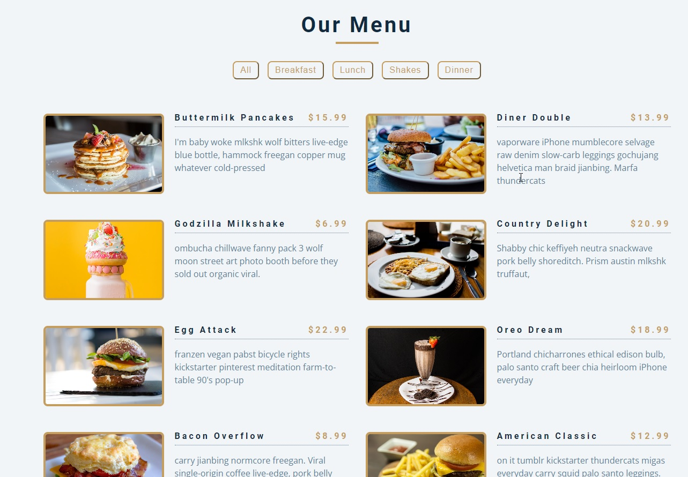

# Graphic Menu

A web page to practice DOM manipulation with many entries and pictures

- Main Goal: [DOM] Practice with DOM manipulation with interactive elements.
- Live Demo: [link](https://orses.github.io/vanilla_javascript/menu_visual/src/)

## Credits

- Project from: Build 15 JavaScript Projects - Vanilla JavaScript Course. Project 8: Menu by John Smilga

  > Video tutoria [link](https://www.youtube.com/watch?v=3PHXvlpOkf4&list=PLk5Zkk61rU84dFw6IJrckxuE50pxV8PaF)
