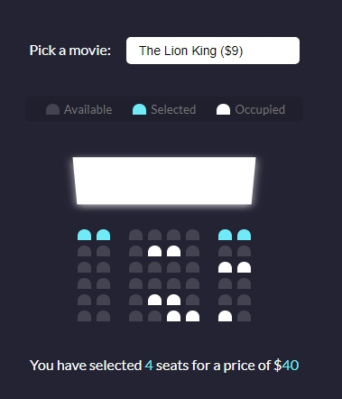

# Movie Seat Booking

A web page with a virtual cinema to choose seats to watch a movie

- Main Goal: Work with local storage to store the seats chosen by the user
- Live Demo: [link](https://orses.github.io/vanilla_javascript/movie_seat_booking/src/)

## Credits

Project from: Udemy course "20 Web Projects With Vanilla JavaScript"

> Course website [link](https://www.udemy.com/course/web-projects-with-vanilla-javascript)
