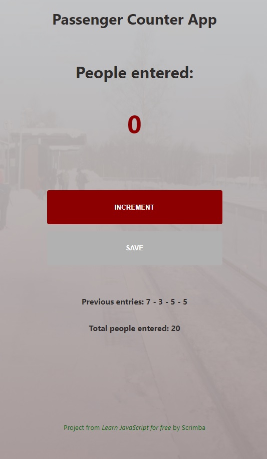

# Basic Project: Passenger Counter

A basic counter to know and practice with the DOM and event listener.

- Main Goal: [DOM] Practice basic sintax and DOM manipulation
- Live Demo: [link](https://orses.github.io/vanilla_javascript/passenger_counter/src/)

## Credits

Project from: Scrimba course "Learn JavaScript for free" by Per Harald Borgen

> Course website [link](https://scrimba.com/learn/learnjavascript)
