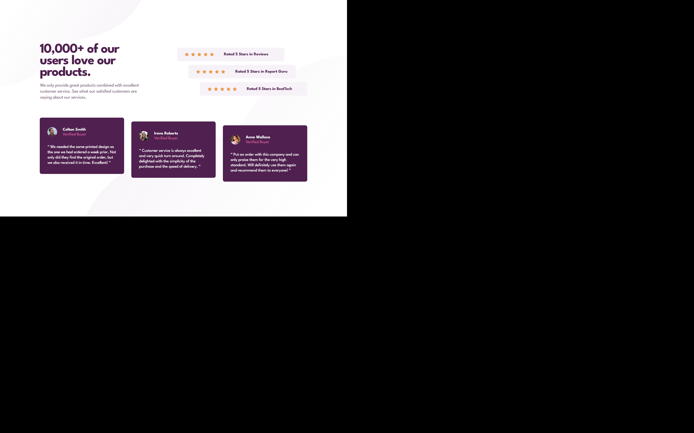

# Frontend Mentor - Social proof section solution

This is a solution to the [Social proof section challenge on Frontend Mentor](https://www.frontendmentor.io/challenges/social-proof-section-6e0qTv_bA). Frontend Mentor challenges help you improve your coding skills by building realistic projects.

## Table of contents

- [Overview](#overview)
  - [The challenge](#the-challenge)
  - [Screenshot](#screenshot)
  - [Links](#links)
- [My process](#my-process)
  - [Built with](#built-with)
  - [What I learned](#what-i-learned)
  - [Continued development](#continued-development)
- [Author](#author)
- [Acknowledgments](#acknowledgments)

## Overview

### The challenge

Users should be able to:

- View the optimal layout for the section depending on their device's screen size.
  This project has many implicit challenges such as playing with different horizontal (ratings) and vertical (testimonials) alignments; and two layouts, one in a column for mobile devices and a mixed one for tablet and desktop devices (two columns for the header and the rating) and a separate row for the testimonials.

### Screenshot

### Links

- Solution URL: [Fronted Mentor](https://www.frontendmentor.io/challenges/social-proof-section-6e0qTv_bA/hub/bem-flexbox-and-grid-ptFVMHERqk)
- Live Site URL: [GitHub](https://orses.github.io/vanilla_javascript/section_social/src/)

## My process

### Built with

- Mobile-first workflow
- Semantic HTML5 markup
- BEM names for CSS class
- CSS custom properties
- Flexbox
- Grid
- CSS variables
- JS for dynamic rendering of star icons

### What I learned

Flexbox and grid have been used for the general layout.
The fonts have been used as if they were local, to test the load and learn to use different font-weights to learn to use @font-face
Working with different alignments has been interesting (horizontal through flexbox for ratings, and vertical with margin for testimonials).

### Continued development

Further progress on grid and treating fonts as local type files.

## Author

- Frontend Mentor - [@orses](https://www.frontendmentor.io/profile/orses)

## Acknowledgments

Thanks to Frontend Mentor and all the people behind designing and creating challenges.
And thanks to everyone who participates giving their opinion on the projects of others. It is good to hear other opinions and perspectives.
