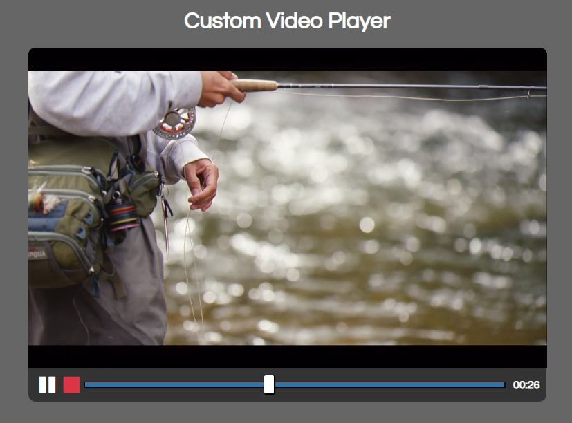

# Custom Video Player

A video player with **custom controls** to know and practice with the `<video>` embed element.

- Main Goal: Practice Video and Audio API
- Live Demo: [link](https://orses.github.io/vanilla_javascript/video_player/src/)

## Credits

Project from: Udemy course "20 Web Projects With Vanilla JavaScript"

> Course website [link](https://www.udemy.com/course/web-projects-with-vanilla-javascript)
